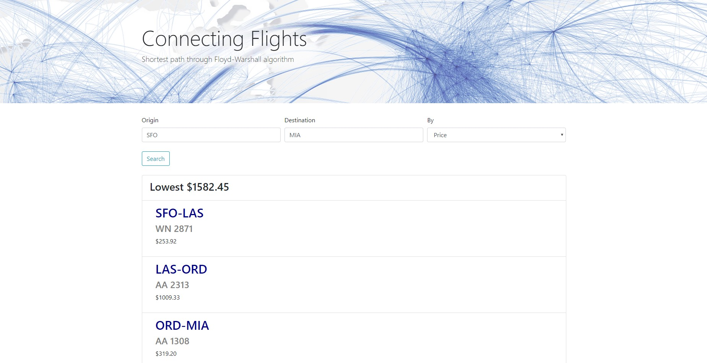

# Connecting Flights

Application to find lowest price, shortest distance, or duration of connecting flights through [Floyd-Warshall algorithm](http://www-math.mit.edu/~rothvoss/18.304.1PM/Presentations/1-Chandler-18.304lecture1.pdf). 
Presentation slides of the project can be found [here](https://docs.google.com/presentation/d/1rhBlG6i2Wh3xkYLhf-2lLqaB5DSqNwVw8vrsuk5ShGk/edit?usp=sharing).
  The documentation of the project can be found [here](https://docs.google.com/document/d/1tE2CqcxogBARtdbCOhyfkIuOBmGlZkC9BPJquxmPqso/edit). 

## Dependencies
Python version 3.7 is used.
`requirements.txt` can be used by `pip` to install all the dependencies:

*  pymongo
*  flask
*  flask-wtf
*  wtforms
*  pytest

## Running the program
Before running, make sure you have a __MongoDB running__ on `localhost:27017` and all the dependencies installed.

__To run console interface:__
Run `python start.py` in directory

__To run web interface:__
Run `python run_webapp.py` and go to `localhost:5000` on your browser. _Note:_ data have to be imported or added using the console interface.

## Importing CSV
Sample data `scaled_down.csv` can be found in the `resources` directory and can be imported through the console interface. You can do this by selecting option `Use CSV` and typing `./resources/import_ready.csv`.

`scaled_down.csv` is a scaled down version of US Bureau of Transportation data `raw_data.csv`, procressed using the script `scale_down_csv.py` we created. `raw_data.csv` is not recommended to be imported since the data size is too big and with no price information avaliable.

Sample quaries to try to get more than one flight in shortest-path:

*  SEA to ATL, price
*  SFO to MIA, price
*  SFO to ATL, distance, price

### More sample data
CSV from [US Bureau of Transportation](https://www.transtats.bts.gov/DL_SelectFields.asp?Table_ID=236) can be used with the program. __The downloaded CSV is NOT ideally ready to be imported__, manipulation to the data is required. Check the fields `Reporting_Airline`, `Flight_Number_Reporting_Airline`, `Origin`, `Dest`, `CRSElapsedTime`, and `Distance` when downloading CSV.

__To make the raw data ready for import__, 
run `python ./shortest/scale_down_csv.py` to scale down the raw data and to add random price information. You can also do it manually by deleteing rows of data and populating a new `price` column in the CSV.
